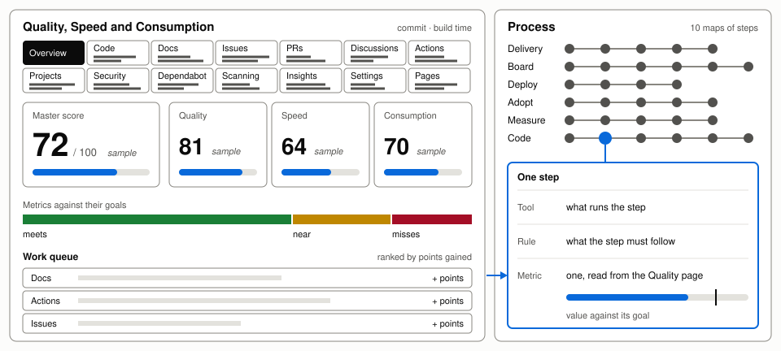
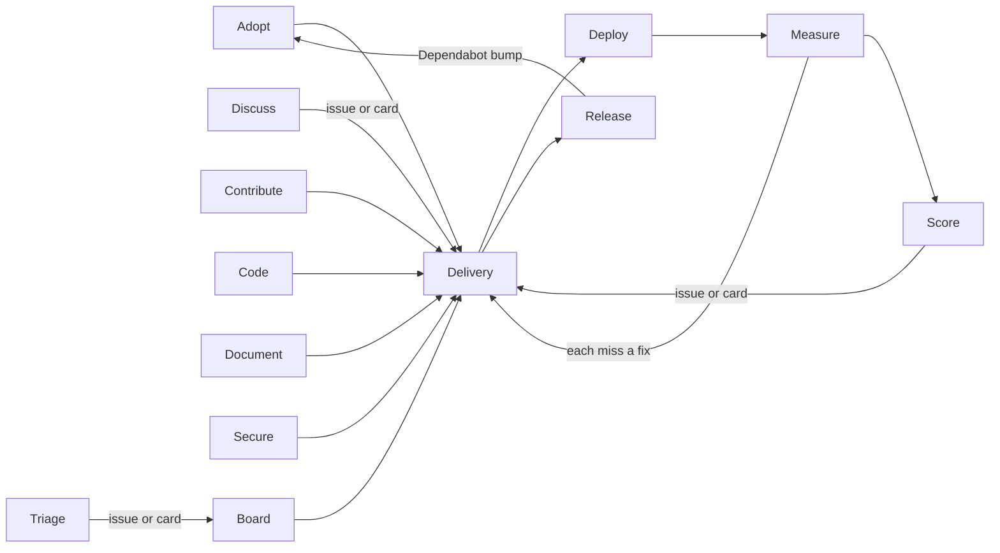

# Git Crafter

Templates for AI agents to run an open-source or open-weight repo with Claude Code or OpenCode.

| License | Publisher | Began as |
|---|---|---|
| [Apache-2.0](LICENSE) | SoulCraft | Code-OS by Colorado Startups ([NOTICE](NOTICE)) |



| Part | Gives a repo |
|---|---|
| [Quality, Speed and Consumption page](https://soulcraft-org.github.io/git-crafter/quality/) | 13 tabs, each scored against an ideal from current, dated sources |
| [Process page](https://soulcraft-org.github.io/git-crafter/) | Process maps: each step's tool, rule and metric |
| [CI standard](templates/ci/README.md) | One reusable workflow on GitHub's standard hosted runners |
| [Rules](rules/) and [guards](tools/) | What Claude sessions may do, and the `permissions.deny` list and hookify rules that block one-way doors |

Both pages are public.


## Quickstart: 3 steps

| Step | Do |
|---|---|
| 1 | Run the block; set `ci.yml`'s `paths`, `short`, `standard`; `pages.yml`'s doc globs; the process config's `repos`, `repo_url`, `heading`; drop unused tabs ([ci](templates/ci/README.md), [process](templates/process/README.md)) |
| 2 | A ruleset on `main` requiring `ci / ci-ok` |
| 3 | Settings, Pages: source "GitHub Actions" |

```bash
GC=../git-crafter  # clone
mkdir -p quality/process .github/workflows
cp -n $GC/templates/quality/config.json quality/config.json
cp -n $GC/templates/process/config.json quality/process/config.json
cp -n $GC/templates/ci/ci.yml $GC/templates/ci/pages.yml .github/workflows/
cp -n $GC/templates/ci/dependabot.yml .github/dependabot.yml
python3 -I $GC/tools/ci_standard.py check --repo .
```

More: [open](templates/open/README.md), [setup.json](templates/setup.json), [agents](templates/agents/README.md), [projects](templates/projects/README.md).

## The 13 tabs

| Each tab scores | Weight | Against |
|---|---|---|
| Quality, Speed and Consumption | A third each | Sourced goals ([quality/SCORING.md](quality/SCORING.md)) |

| Tab ids | Default |
|---|---|
| `code` `documentation` `issues` `pull-requests` `discussions` `actions` `projects` `security` `dependabot` `scanning` `insights` `settings` | On |
| `pages` | Off: it scores a site, so a repo's config turns it on |

What each measures, and which to drop: [templates/quality](templates/quality/README.md).

## The maps


```mermaid
flowchart LR
  AD[Adopt] --> DL[Delivery] --> DP[Deploy] --> ME[Measure]
  DL --> RE[Release] -->|Dependabot bump| AD
  ME --> SC[Score] -->|issue or card| DL
  DI[Discuss] -->|issue or card| DL
  CT[Contribute] --> DL
  CO[Code] --> DL
  DO[Document] --> DL
  SE[Secure] --> DL
  TR[Triage] -->|issue or card| BO[Board] --> DL
  ME -->|each miss a fix| DL
```

Each map's steps: [pages/maps](pages/maps/README.md).

## Rules for Claude sessions

| Rule | Loads | Says |
|---|---|---|
| [delegation](rules/delegation.md) | Every turn | Who decides and merges |
| [keys](rules/keys.md) | Every turn | No session handles a key |
| [compute](rules/compute.md) | Every turn | Cloud first, free credits, flat plans |
| [writing-and-gates](rules/writing-and-gates.md) | Every turn | Visual docs, plain prose |
| [compute-detail](rules/compute-detail.md), [comfy](rules/comfy.md), [gates](rules/gates.md), [keys-detail](rules/keys-detail.md) | Matching files | CI pool, GPU tiers, gates |
| [merging](skills/merging/SKILL.md) | Reviewing and merging | Merge conditions |

| Item | Detail |
|---|---|
| What loads when | [memory](https://code.claude.com/docs/en/memory) and [skills](https://code.claude.com/docs/en/skills) docs, read 2026-11-03 |
| Install | `tools/claude_os_sync.py apply` copies rules and guards into `~/.claude` from [manifest.json](manifest.json) |
| When | [CONTRIBUTING](CONTRIBUTING.md#releases) |

## Folder map

| Folder | Holds |
|---|---|
| `actions/` | The `pages` and `ci-pool` actions |
| `config/` | Its Quality config, its collector in `config/quality/collectors/`, and [account.example.json](config/account.example.json) for a private overlay (`apply --overlay DIR`) |
| `pages/` | The Process and Metrics builder and map library, `pages/maps/` |
| `quality/` | The Quality engine and collectors ([README](quality/README.md)) |
| `rules/` | Rules for Claude sessions |
| `skills/` | The `merging` skill |
| `templates/` | Starters: `quality/`, `process/`, `ci/`, `open/`, `setup.json`, `agents/`, `projects/` |
| `tests/` | Page, verify tests |
| `tools/` | Guards, lints, sync, org collector |
| `wiki/` | Wiki pages, published on merge |

## Help

| Need | Go to |
|---|---|
| Help, bugs, ideas | [SUPPORT.md](SUPPORT.md) |
| Changes and template fixes | [CONTRIBUTING.md](CONTRIBUTING.md) |
| Security problems | [SECURITY.md](SECURITY.md) |
| Maintainer | SoulCraft, publisher |
